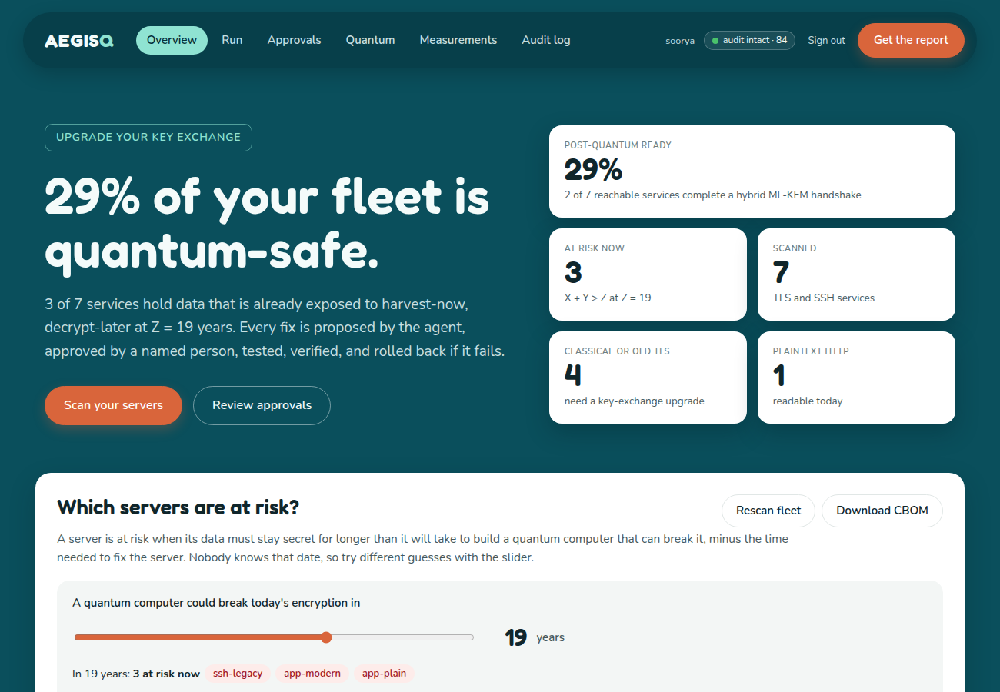
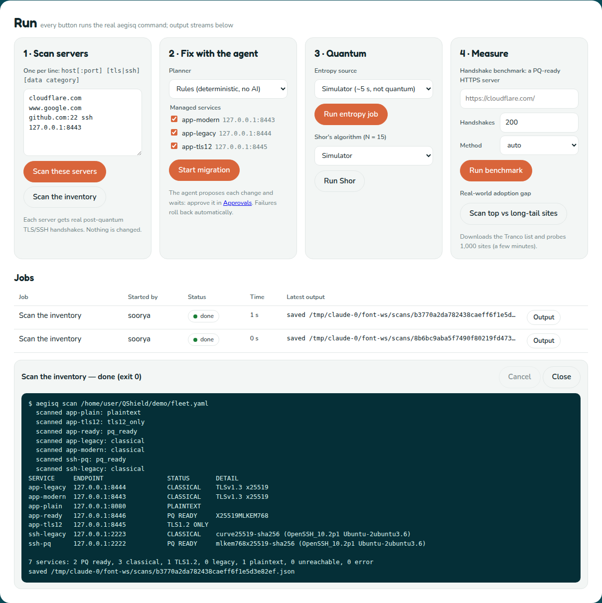

<p align="center"></p>

<h1 align="center">AegisQ</h1>

<p align="center">Runs on Windows, macOS and Linux · Python 3.10–3.13 · web app + CLI · agentic AI (Gemma 4, Claude or rules) · CycloneDX 1.6 CBOM · ML-KEM hybrid TLS and SSH · IBM quantum hardware</p>

**A post-quantum migration engine: it finds the servers that are still classical, shows which ones matter most, and fixes them safely with a human in the loop.**

Traffic recorded today can be decrypted once a large quantum computer exists ("harvest now, decrypt later"). Chrome, Firefox and Cloudflare already use hybrid ML-KEM key exchange, but most company web servers, internal services and SSH endpoints do not. AegisQ:

1. **Scans:** probes every TLS and SSH service with real post-quantum handshakes.
2. **Inventories:** writes a Cryptographic Bill of Materials (CBOM) in CycloneDX 1.6, validated against the official schema.
3. **Scores:** ranks services with Mosca's inequality (X + Y > Z), with Z as a dashboard slider.
4. **Fixes:** an agentic AI (Gemma 4 by default, or Claude) plans the migration, proposes a minimal config patch, waits for a named human to approve it, applies it, verifies it, and rolls back on failure. Every safety rule is enforced in Python, not in the prompt; a deterministic rules planner does the same without AI.
5. **Reports:** builds the migration report from a tamper-evident, hash-chained audit log.

It also includes a quantum entropy module (IBM hardware + Toeplitz extraction), an honest Shor demo, a handshake benchmark, and a real-world adoption-gap scan over the Tranco list. Everything can be run from the **web app** (buttons with live output) or from the `aegisq` command line.

---

## Quick start

You need **Python 3.10+** and, for the demo servers only, **Docker Desktop**.

**1. Install** (once, in the repo folder):

| Windows (PowerShell) | macOS / Linux |
|---|---|
| `py -m venv .venv` | `python3 -m venv .venv` |
| `.venv\Scripts\activate` | `source .venv/bin/activate` |
| `pip install -e ".[dev,agent,quantum]"` | `pip install -e ".[dev,agent,quantum]"` |

`pip install -e .` installs AegisQ from this folder and adds the `aegisq` command to the virtual environment. The extras add the test tools (`dev`), the Claude planner (`agent`) and Qiskit (`quantum`); the Gemma 4 planner needs no extra. Run `aegisq doctor` to see which optional parts are available.

**2. Add your keys (optional).** Create `demo/.env` with one `NAME=value` per line. Every key is optional; see [Keys](#keys-yours-someone-elses-or-none) for what each one adds and what works without it.

```
GEMINI_API_KEY=...               # agentic AI with Gemma 4 (free: aistudio.google.com/apikey)
QISKIT_IBM_TOKEN=...             # real IBM quantum hardware (free account: quantum.cloud.ibm.com)
AEGISQ_API_TOKENS=you:<16+ random characters>   # your dashboard login
AEGISQ_AUDIT_KEY=<long random string>           # HMAC audit chain
```

Make random strings with `python -c "import secrets; print(secrets.token_urlsafe(24))"`. Then run `aegisq doctor`: the first line shows the `.env` file it loaded, and every optional part says `ok` or how to enable it (`--` means optional and off, not broken).

**3. Start the demo servers** (7 containers on 127.0.0.1; Docker Desktop must be running):

```
docker compose -f demo/docker-compose.yml up -d --build app-modern app-legacy app-tls12 app-ready app-plain ssh-pq ssh-legacy
```

**4. Open the web app and run everything from there:**

```
aegisq serve --inventory demo/fleet.yaml
```

Open http://127.0.0.1:8000 and sign in with your token (the part after the colon in `AEGISQ_API_TOKENS`, or the one-time token `serve` prints). The **Run** section has a button for every step:

1. **Scan servers:** type any servers, one per line (`cloudflare.com`, `github.com:22 ssh`, `mail.example.com:993 tls payments`), or scan the inventory.
2. **Fix with the agent:** pick the planner (Gemma 4, rules or Claude) and the managed services, then **Start migration**. Approve or reject each proposed diff in **Approvals**; a coral banner appears when one is waiting.
3. **Quantum:** run the entropy job on the simulator or real IBM hardware, and Shor's algorithm.
4. **Measure:** benchmark a PQ-ready HTTPS server, or measure the real-world adoption gap.

Each button runs the real `aegisq` command in the background. Its output streams into the page, it can be cancelled (a cancelled migration rolls back anything unverified and withdraws its approval request), and the results appear in the sections below. Start with `--read-only` to show results without the buttons.

**Or use the terminal** (the same commands on every OS):

```
aegisq scan demo/fleet.yaml               # real PQ handshakes against every service
aegisq cbom --out cbom.json               # CycloneDX 1.6 CBOM, schema-validated
aegisq risk --sweep 5,10,15,20            # Mosca ranking across Z assumptions
aegisq serve --inventory demo/fleet.yaml  # dashboard on http://127.0.0.1:8000
aegisq migrate demo/fleet.yaml --planner local   # Gemma 4 agent: approve each change on the dashboard
aegisq migrate demo/fleet.yaml --planner rules   # same, no AI
aegisq migrate demo/fleet.yaml --approve-in terminal   # approve each diff in this terminal instead
aegisq entropy run --source ibm           # real IBM quantum hardware (or --source simulated)
aegisq shor --backend ibm                 # Shor on IBM hardware (or the default simulator)
aegisq audit verify                       # check the hash-chained audit log
aegisq report                             # migration report (Markdown + HTML)
```

**Docker only (no Python on the host):** `docker compose -f demo/docker-compose.yml up -d --build` starts the demo servers plus the dashboard on http://localhost:8000, with the same Run section (token `aegisq-demo-token-change-me` unless `AEGISQ_API_TOKENS` is in `demo/.env`). Run commands with `docker compose -f demo/docker-compose.yml run --rm --no-deps aegisq scan fleet.docker.yaml`. If you later run the native dashboard, stop this one first (`docker stop aegisq-dashboard`) or use `--port 8001`. See [TESTING.md](TESTING.md#docker-only-windows-or-no-python-setup).





### The demo fleet

| Service | What it is | Expected result |
|---|---|---|
| `app-modern` :8443 | nginx 1.29 on OpenSSL 3.5, classical config | patched, verified **PQ ready** |
| `app-legacy` :8444 | nginx 1.25 on OpenSSL 3.0 | **planned failure**: `nginx -t` rejects the group, config restored, agent names OpenSSL 3.0 as the root cause |
| `app-tls12` :8445 | modern library, TLS 1.3 disabled | patched (protocols + groups), verified |
| `app-ready` :8446 | already `X25519MLKEM768` | left alone |
| `app-plain` :8080 | plaintext HTTP | flagged critical whatever Z is |
| `ssh-pq` :2222 | OpenSSH 10.2 | `mlkem768x25519-sha256` |
| `ssh-legacy` :2223 | OpenSSH 10.2 with classical `KexAlgorithms` | flagged, with sshd_config advice |

All ports bind to `127.0.0.1`: the agent only ever changes servers the team owns. To restore the starting configs, run `python demo/setup.py --configs-only`, then `docker compose -f demo/docker-compose.yml restart app-modern app-legacy app-tls12 app-ready app-plain` (or `make demo-reset` where `make` is available).

---

## How it works

### Scanner

AegisQ asks one question per service with a real handshake: *will it complete a post-quantum key exchange if that is the only option offered?*

- **Native TLS probe (default).** AegisQ builds the TLS 1.3 ClientHello itself, with a genuine ML-KEM-768 encapsulation key plus an X25519 share (1,216 bytes) for `X25519MLKEM768` and nothing else. The negotiated group is in the plaintext ServerHello, so the answer needs no OpenSSL 3.5 on the scanning host. The parser is strict (fragmented records, HelloRetryRequest, alerts, plaintext HTTP, garbage, timeouts) and fuzz-tested.
- **Extra TLS checks:** a browser-like offer (does the server *prefer* PQ when a client offers both?), TLS 1.2 (curve from ServerKeyExchange, certificate from the plaintext flight), TLS 1.0/1.1, the certificate (key type and size, signature hash, expiry), and plain HTTP.
- **Native SSH probe.** SSH negotiates in the clear, so AegisQ reads the server's `KEXINIT` (every kex method, host key, cipher and MAC) without credentials. It reports what a PQ-only client would agree on, plus weak algorithms.
- **Reference backends.** `--tls-backend openssl` runs `openssl s_client -tls1_3 -groups X25519MLKEM768`, and `--ssh-backend openssh` runs `ssh -v -o KexAlgorithms=mlkem768x25519-sha256,...`. Both refuse to run if the local tool is too old (OpenSSL < 3.5 or OpenSSH < 9.9), since a "failure" from such a tool is a false negative. `--cross-check` runs both and flags any disagreement. The `aegisq` Docker image ships OpenSSL 3.5.5 and OpenSSH 10.2.
- **Speed and safety:** asyncio, 50 concurrent services, 5 s per probe, failures isolated per service, allow/deny scope (CIDRs and DNS suffixes, checked after DNS resolution), and argv-only subprocesses with validated hosts (no `-oProxyCommand=` tricks).

Statuses: `pq_ready`, `classical`, `tls12_only`, `legacy_tls`, `plaintext`, `unreachable`, `error`. Use `aegisq scan --fail-on classical|at-risk` as a CI gate (exit code 2).

### CBOM

One `cryptographic-asset` component per algorithm per service, with the host as a `aegisq:host` property, plus protocol, certificate, signature-algorithm and public-key assets linked by `bom-ref`. A classical service gets an `X25519` entry with `nistQuantumSecurityLevel: 0`. Every CBOM is validated against the bundled official CycloneDX 1.6 JSON schema (with its SPDX and JSF dependencies), plus referential-integrity checks the schema cannot express. AegisQ refuses to write a CBOM that fails. `aegisq cbom-validate FILE` validates any 1.6 BOM.

### Risk scoring

A service is at risk when its data must stay secret longer than the time left before a quantum computer, minus the time to migrate: **X + Y > Z**. The score is the margin X + Y − Z; ready services score zero.

- **X:** from the service's `data_category` (defaults: health 25, payments 7, marketing 1; override per category in config or per service with `retention_years`).
- **Y:** from the scan. A config change on TLS 1.3 (≈0.1–0.5) is quicker than a library upgrade (1.5) or a TLS upgrade (2), and plaintext needs TLS first (3). If the agent learns a server's OpenSSL version (for example from a failed `nginx -t`), Y updates automatically.
- **Z:** a slider, because nobody knows it. The dashboard shows the published resource estimates beside it.
- **Plaintext** is readable today, so Z does not discount it: it is always critical.

### Migration agent

The agent works the fleet highest-risk first. It can only call these tools, and the tools refuse unsafe actions on their own:

| Tool | Guardrail in code |
|---|---|
| `list_services` | read-only |
| `read_config` | read-only; only services with a `managed` block; the model never sees or picks a path; symlinks refused |
| `propose_patch` | strict unified-diff parser; every changed line must be exactly one `ssl_ecdh_curve` or `ssl_protocols` directive (no `;`, `{`, `$`, quotes); groups from an allowlist; PQ hybrid first; classical fallback required; TLS 1.3 required; no SSLv3/TLS 1.0/1.1; result re-diffed independently; recorded on its own git branch |
| `request_approval` | blocks until a named human approves or rejects on the dashboard/CLI; the identity comes from the API token, never from the request |
| `apply_patch` | needs an approval that is approved, unexpired, unused and bound to the SHA-256 of this exact diff; refuses if the live file drifted; re-runs the guardrails; backs up; runs `nginx -t`; restores automatically if the test or the reload fails; one unverified change in flight at a time |
| `verify` | re-runs the PQ probe and an HTTP health check; fixed only if both pass |
| `rollback` | always available; restores the last known-good config and reloads |
| `write_report` | read-only |

**Why it is agentic:** the model is given a goal ("migrate the fleet") and the tools above, and decides each next step from what it has observed: which service to take next, what change to propose, how to react when a config test fails (on `app-legacy` it reads the `nginx -t` error, identifies OpenSSL 3.0 as the cause, does not retry, and recommends an upgrade), and what to tell each owner. It has autonomy but not authority: every change waits for a human, and the tools enforce the rules.

When the agent stops (finished, crashed, out of turns, or cancelled from the dashboard), anything still applied but unverified is rolled back by code, and a pending approval request is withdrawn. Three planners drive the same toolbox:

- `--planner claude`: Claude (`claude-opus-5-5`, adaptive thinking, tool use) chooses each call. Needs `ANTHROPIC_API_KEY` and `pip install 'aegisq[agent]'`. Server-side refusal fallback is enabled.
- `--planner local`: an open model chooses each call through any OpenAI-compatible chat endpoint. The default is **Gemma 4** (`gemma-4-31b-it`) on the Gemini API: set `GEMINI_API_KEY` ([get one](https://aistudio.google.com/apikey)). For a model on your own machine, point it at Ollama, LM Studio, llama.cpp or vLLM: `AEGISQ_LLM_BASE_URL=http://127.0.0.1:11434/v1` and `AEGISQ_LLM_MODEL=<name from ollama list>`. No extra packages are needed.
- `--planner rules`: a deterministic driver for air-gapped sites and CI.

`--planner auto` (the default) picks Claude if `ANTHROPIC_API_KEY` is set, else `local` if `GEMINI_API_KEY` or `AEGISQ_LLM_BASE_URL` is set, else `rules`. The model never gets more power than the tools allow, so a weaker model can stop early or make a refused call, but cannot make an unsafe change.

The Gemini free tier allows 16,000 input tokens per minute for Gemma 4 31B, so a full fleet run takes several minutes; AegisQ waits out the rate limit using Google's own retry hint.

The fix itself is one line: `ssl_ecdh_curve X25519MLKEM768:X25519;` (AegisQ keeps the classical groups already configured after the hybrid). It only works when nginx is built against OpenSSL 3.5+, which is exactly what the `app-legacy` demo shows.

### Quantum entropy module

```bash
QISKIT_IBM_TOKEN=... aegisq entropy run --source ibm          # real hardware, 100 qubits x 10,000 shots
aegisq entropy run --source simulated                         # offline, ~5 s: FakeFez readout errors, labelled NOT quantum
aegisq entropy run --source simulated --noise full            # offline, ~45 s: full device noise model
aegisq entropy analyze --key-out key.bin                      # re-analyse the saved run; key written 0600
```

The pipeline:

1. Pick the 100 qubits with the lowest reported readout error and pass them as `initial_layout`.
2. Run two calibration circuits (all |0⟩ and all |1⟩) in the same job.
3. Measure Hadamard on each qubit: 1,000,000 raw bits.
4. Compute per-qubit bias, the qubit-to-qubit correlation heatmap and lag-1 autocorrelation, each against the ±1.96/√n chance band.
5. Take the NIST SP 800-90B most-common-value min-entropy with a 99% bound per qubit, and use the minimum as *h*.
6. Run a seeded Toeplitz extractor over GF(2) with output length `m = ⌊n·h⌋ − 2·log2(1/ε)`. For ε = 2⁻⁶⁴, n = 10,000 and h = 0.94 that is 9,272 bits. The FFT implementation is checked to be exact against the naive matrix product.
7. Run the SP 800-22 monobit and runs tests side by side with `os.urandom`.
8. Derive the key with HKDF-SHA256 over the extracted bytes plus 32 bytes of `os.urandom`.

Only a fingerprint of the key is ever logged. The dashboard shows the IBM job ID, readout error, bias, min-entropy, autocorrelation and heatmap charts, plus a "what is and isn't guaranteed" table. The bits are **not** secret from IBM and **not** device-independent; the HKDF mix is why the key is never weaker than a normal one.

`aegisq shor` runs order finding for N = 15, a = 7 (period 4, factors 3 × 5) and states plainly that it is a toy built with a pre-compiled multiplier.

### Benchmark and real-world scan

```bash
aegisq benchmark https://localhost:8443/ -n 1000     # curl with OpenSSL 3.5 if present, else native
aegisq realworld --download                          # top 500 vs random 500 from Tranco ranks 100k-1M
```

The benchmark reports p50/p99 for `X25519MLKEM768` versus `X25519` and the measured key-share sizes (client 1,216 vs 32 bytes, server 1,120 vs 32, about +2.3 KB per handshake). It also notes when the ClientHello no longer fits one TCP segment. On localhost the numbers measure computation only. The real-world scan sends one handshake per site, refuses private address space, uses a seeded sample, and reports the share of ready sites, connection failures and total time.

---

## Dashboard and API

```
aegisq serve --inventory demo/fleet.yaml   # the fleet it can rescan and migrate (optional)
             --port 8001                   # default 8000
             --read-only                   # results only: no Run buttons
```

The page is split into tabs, so you see one thing at a time:

| Tab | What it is for |
|---|---|
| **Overview** | How much of your fleet is quantum-safe, and *which servers are at risk?* Drag the "years until a quantum computer" slider; each server shows its risk with a one-line reason, and clicking it shows the numbers behind it. Rescan and CBOM download live here. |
| **Run** | Buttons for everything: scan typed-in servers or the inventory, migrate with Gemma 4 / rules / Claude, quantum entropy and Shor on the simulator or IBM hardware, benchmark, real-world gap; each with live output and Cancel. |
| **Approvals** | Each proposed change as a diff with Approve / Reject. The tab shows a count, and Run shows a banner, when one is waiting. |
| **Quantum** | Entropy charts (IBM job ID, bias, min-entropy, correlations) and the Shor result. |
| **Measurements** | Handshake cost and the real-world adoption gap. |
| **Audit log** | Every action, with the integrity badge in the header. **Get the report** is always in the header. |

Options that need a key or a package are greyed out with the reason. The page uses the rounded [Fredoka](https://github.com/hafontia/Fredoka-One) and [Nunito](https://github.com/googlefonts/nunito) fonts, bundled with AegisQ under the SIL Open Font License (`src/aegisq/web/static/OFL-*.txt`), so nothing is loaded from the internet.

`aegisq serve` binds to `127.0.0.1` (use `--host 0.0.0.0` only on a trusted network). Every `/api` route requires `Authorization: Bearer <token>`. Tokens map to people via `AEGISQ_API_TOKENS="alice:<token>,bob:<token>"`; if none are set, a one-time token is printed. Other protections:

- Approvals and jobs are recorded under the token's identity in the audit log.
- Jobs can only start the commands listed below, with validated options, as argument lists (never a shell).
- Failed logins are throttled.
- Responses carry a strict CSP, no third-party code is loaded, and all data is rendered with `textContent`.

| Endpoint | Purpose |
|---|---|
| `GET /api/overview?z=` | ranking, statuses, estimates |
| `GET /api/cbom` | the CBOM |
| `GET /api/approvals`, `POST /api/approvals/{id}/decision` | human approvals |
| `GET /api/audit`, `GET /api/audit/verify` | audit log and chain check |
| `GET /api/capabilities` | what this dashboard can run (planners, quantum, IBM, managed services) |
| `POST /api/jobs` | start a job: `scan` (typed targets or the inventory), `migrate`, `entropy`, `shor`, `benchmark`, `realworld` |
| `GET /api/jobs`, `GET /api/jobs/{id}?since=N`, `POST /api/jobs/{id}/cancel` | job list, live output, cancel |
| `POST /api/scan` | rescan the inventory (older API; the Run section uses `/api/jobs`) |
| `GET /api/entropy`, `/api/shor`, `/api/benchmark`, `/api/realworld` | saved results |
| `GET /api/report.{md,html}` | migration report |

## Using it on your own servers

- **Scan anything you can reach:** type hosts into **Run → Scan servers**, or run `aegisq scan hosts.txt`. Scanning only performs handshakes and changes nothing. `cloudflare.com` should show **PQ ready**; if it does not, your network intercepts TLS.
- **Fix servers you own:** add them to an inventory with a `managed:` block (below) and start the dashboard with `--inventory`. AegisQ edits the nginx config file and runs `nginx -t` / reload with the commands you list, so it must run on the machine (or in the container) that has the config, as the demo fleet does with Docker.
- **Scope:** `scan.scope.allow` / `deny` in the config limits which networks may be scanned at all (checked after DNS resolution).

**Servers to test with.** Paste into **Run → Scan servers** (one per line):

```
cloudflare.com                  # PQ ready: hybrid ML-KEM in production
127.0.0.1:8443                  # demo app-modern: classical until the agent fixes it
127.0.0.1:8444                  # demo app-legacy: classical, cannot be fixed (OpenSSL 3.0)
127.0.0.1:8445                  # demo app-tls12: TLS 1.2 only
127.0.0.1:8080                  # demo app-plain: plaintext
127.0.0.1:2223 ssh              # demo ssh-legacy: classical SSH key exchange
tls-v1-2.badssl.com:1012        # public test server: TLS 1.2 only, no quantum protection
tls-v1-0.badssl.com:1010        # public test server: legacy TLS 1.0
http.badssl.com:80              # public test server: plaintext HTTP
```

The demo servers always give these results. The [badssl.com](https://badssl.com) hosts are public servers kept deliberately weak for testing; public sites change over time, so treat any other site's result as a live measurement, not a fixed answer.

## Inventory format

```yaml
defaults: {data_category: internal}
services:
  - name: payments-api
    host: pay.corp.example
    port: 443
    data_category: payments
    owner: billing
    managed:                         # omit for scan-only services
      config_path: /etc/nginx/conf.d/pay.conf
      test_cmd: [nginx, -t]          # argv lists, never shell strings
      reload_cmd: [nginx, -s, reload]
      version_cmd: [nginx, -V]
      health_url: https://pay.corp.example/healthz
  - {name: bastion, host: 10.0.0.5, protocol: ssh, data_category: health}
```

A plain host list also works: `host[:port] [tls|ssh] [category]` per line. In containers, bind-mount the config **directory**, not the file, so atomic replacements are visible.

## Configuration

See [`aegisq.example.yaml`](aegisq.example.yaml). Secrets come only from the environment, and every one is optional. Put them in `demo/.env` (one `NAME=value` per line): Docker Compose reads it, and so does the native `aegisq` command (it looks for `.env`, then `demo/.env`, in the current folder, or the file named by `AEGISQ_ENV_FILE`; variables already set in your shell win). `aegisq doctor` shows which file it loaded.

| Variable | Used for | Without it |
|---|---|---|
| `AEGISQ_API_TOKENS` | dashboard logins (`alice:<16+ chars>,bob:...`) | `serve` prints a one-time token |
| `AEGISQ_AUDIT_KEY` | turns the audit chain into an HMAC chain | plain SHA-256 chain |
| `ANTHROPIC_API_KEY` | `--planner claude` | use `local` or `rules` |
| `GEMINI_API_KEY` | `--planner local` with Gemma 4 on the Gemini API | use Ollama, `claude` or `rules` |
| `AEGISQ_LLM_BASE_URL`, `AEGISQ_LLM_MODEL`, `AEGISQ_LLM_API_KEY` | `--planner local` with another endpoint or model | Gemini API if `GEMINI_API_KEY` is set, else Ollama on 127.0.0.1 |
| `QISKIT_IBM_TOKEN` | entropy from real IBM quantum hardware | `--source simulated` |

### Keys: yours, someone else's, or none

**Everyone who runs AegisQ uses their own keys**, in their own `demo/.env`. That file is in `.gitignore`, so keys are never committed. Don't paste keys into code, issues or chat; if one leaks, delete it at its provider and make a new one.

**No keys at all** still gives you the whole tool:

| Feature | With no keys |
|---|---|
| Scanning, risk ranking, CBOM, dashboard, report, audit log | works fully |
| Fixing servers | `--planner rules` (same guardrails and outcomes, no AI) |
| Agentic AI | a free Gemini key ([aistudio.google.com/apikey](https://aistudio.google.com/apikey)), or a model on your own machine with [Ollama](https://ollama.com): no key or account |
| Quantum | `--source simulated` and `aegisq shor`; real IBM hardware needs a free [IBM Quantum](https://quantum.cloud.ibm.com) account |
| Dashboard login | `aegisq serve` prints a one-time token |

`aegisq doctor` and the dashboard's **Run** section show what is missing and how to get it.

**Sharing one dashboard** (a demo, a team): the keys stay on the machine running `aegisq serve`; browsers never see them. Give each person their own login, so approvals and jobs are recorded under their name:

```
AEGISQ_API_TOKENS=soorya:<16+ chars>,alex:<16+ chars>,prof:<16+ chars>
```

Everyone's agent runs then use the server's Gemini quota, and anyone with a login can start scans and migrations, so only hand logins to people you trust. For viewers, run a second copy with `aegisq serve --read-only --port 8001`: results only, no buttons.

## Testing and presenting

- [TESTING.md](TESTING.md) walks through testing every part, with the expected output for each.
- [PRESENTATION.md](PRESENTATION.md) is the day-before checklist, the 3-minute demo script, fallbacks and likely questions.

AegisQ runs natively on Linux, macOS and Windows (`pip install -e .`, then `aegisq ...`), or entirely in Docker. CI runs the test suite on all three.

## Development

```bash
make dev          # editable install with all extras
make lint typecheck test
make demo-up integration   # end-to-end against the Docker fleet
```

The test suite (225+ tests, run in CI on Linux with Python 3.10–3.13, Windows and macOS) covers:

- Fake TLS/SSH servers covering every protocol edge case.
- A fake `nginx` that behaves like OpenSSL 3.0 or 3.5.
- A 4,000-case mutation fuzzer asserting no accepted patch ever changes another line.
- Audit tamper and concurrency tests.
- Scripted Claude and Gemma models that try to bypass the guardrails, plus the Gemma client's retries against a local HTTP server.
- API security tests, including job-request validation and injection attempts.
- Dashboard jobs run end to end, cancel with graceful rollback, and `.env` loading.
- NIST SP 800-22 reference vectors.

The integration suite drives the real Docker fleet.

Load tests use [k6](https://k6.io) (local binary or the `grafana/k6` image). `make loadtest` covers four scenarios: dashboard polling by 50 viewers, a two-approver race on every approval, TLS handshake load against the demo fleet, and token guessing. See [loadtest/README.md](loadtest/README.md).

## Troubleshooting

| Symptom | Fix |
|---|---|
| `aegisq doctor` shows `--` for openssl / openssh / curl | Optional cross-checks; the built-in probes do the scanning. Nothing to fix. |
| Keys in `demo/.env` are not picked up | Run `aegisq` from the repo folder (it reads `.env`, then `demo/.env`), or set `AEGISQ_ENV_FILE`. `doctor`'s first line shows which file was loaded. |
| Gemma option greyed out in the dashboard | `GEMINI_API_KEY` is missing; add it to `demo/.env` and restart `aegisq serve`. |
| "rate limited, retrying" during a Gemma run | Normal on the Gemini free tier; AegisQ waits and continues. Limit the run to one service for a faster demo. |
| Dashboard says "Invalid token" | Paste only the part after the colon in `AEGISQ_API_TOKENS`. |
| `address already in use` on port 8000 | Another dashboard is running (often the Docker one: `docker stop aegisq-dashboard`), or use `--port 8001`. |
| A demo server shows UNREACHABLE | Docker Desktop is not running or the container stopped: re-run the `docker compose ... up -d` line. |
| `No module named 'fcntl'` or `pull access denied for aegisq-demo/sshd` | You have an old copy: `git pull` (both are fixed). |
| A cloud site shows classical but should be PQ ready | Your network intercepts TLS (some school and office Wi-Fi); try another network. |

## Threat model in one paragraph

Key exchange is the urgent risk because a recorded handshake can be broken later. Signatures only need to hold at handshake time, so certificates are reported but rated lower. Hybrid `X25519MLKEM768` (FIPS 203 ML-KEM-768 plus X25519) stays secure if either algorithm holds. See [SECURITY.md](SECURITY.md) for AegisQ's own security model.
